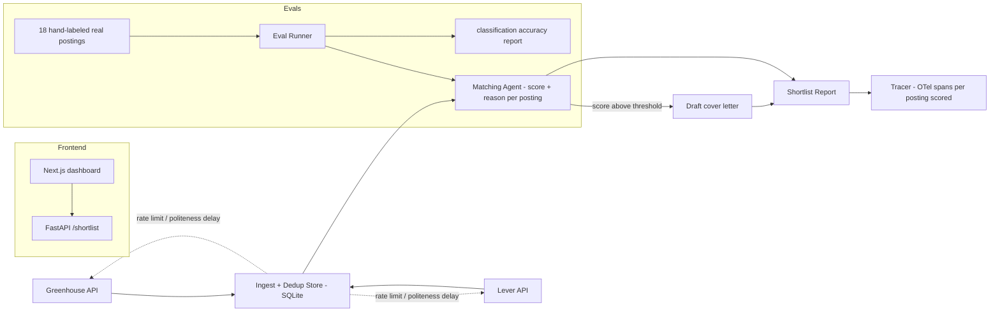

# Architecture

## Overview

Given a candidate profile, fetches real live job postings from Greenhouse and Lever's
public job-board APIs, scores each for fit, and drafts a cover-letter opening for the
strongest matches. **It never submits anything to a real employer** — that scope
boundary is load-bearing, not incidental, and is enforced by a structural test
(`tests/test_no_submission_capability.py`) that fails the build if any
submission-shaped function ever gets added.

## The scope decision: match and draft, never submit

"Auto-apply" as literally described — a bot submitting job applications on someone's
behalf — has two distinct real risks, resolved *before* any code was written (see the
plan this was built from):

1. **Sourcing risk.** LinkedIn/Indeed scraping has real legal precedent against it
   (*hiQ Labs v. LinkedIn*). Solved by sourcing exclusively from Greenhouse
   (`boards-api.greenhouse.io`) and Lever (`api.lever.co`) — both official, documented,
   public APIs explicitly built for third-party job-board consumption. Confirmed live:
   Greenhouse returned real current postings for airbnb (180), stripe (548, including a
   200-posting fetch used to build the eval set), pinterest (216), robinhood (128),
   coinbase (162), asana (143) — zero auth required. Lever's API is equally real and
   functional, confirmed against several company slugs, though fewer currently have
   open postings via the endpoint at any given time (a fact about current hiring
   activity, not an integration gap).
2. **Reputational/quality risk.** A bot submitting applications under someone's name
   with no review could actively damage a job search, not just be low-value filler.
   Solved by stopping at **draft + shortlist** — a human always reviews and submits
   manually. The frontend surfaces this as a persistent, prominent disclaimer, not fine
   print.

## Components

### Greenhouse/Lever clients — a real, live data-quality bug found and fixed
Both clients hit real public APIs (no scraping). One genuine bug discovered while
building this: Greenhouse's `content` field (`?content=true`) is **HTML-entity-escaped
HTML** — the literal text `&lt;p&gt;` rather than a real `
` tag. Stripping tags with
BeautifulSoup *before* unescaping entities left the literal `&lt;p&gt;` text untouched
in job descriptions. Fixed by unescaping entities first, then stripping the resulting
real tags — confirmed against live Stripe/Asana postings. `get_text(separator="\n")`
also fragmented sentences around inline tags like `<strong>` (`"a \ndriven\n AI"`);
fixed by protecting genuine paragraph breaks (2+ newlines) before collapsing the
spurious single newlines inline tags introduce.

### Dedup store (`dedup_store.py`) — SQLite, the guardrail that matters even without submission
Every posting is keyed `source:id`. A posting already seen in a prior run is filtered
out before it ever reaches the matching agent — verified with a real dedup test
(`tests/test_dedup_store.py`: first run sees N unseen, second run sees 0). This is what
makes running this tool daily non-spammy and cost-bounded, independent of the
never-submit decision.

### Matching agent (`agent/matcher.py`) — a different agentic shape again
Project 1 is retrieve-then-generate; project 2 is a multi-turn tool-calling
investigation loop; this project is a **single-shot scoring call per posting** inside an
autonomous **decision pipeline** (fetch → dedup → score → threshold-filter → draft). The
interesting engineering here is the guardrails around repeated autonomous execution
against real external APIs, not multi-step reasoning per item.

### Draft generator (`agent/drafter.py`)
One more LLM call, only for postings scoring at/above a threshold (default 75/100) —
produces a short, specific paragraph, explicitly framed as a draft for the candidate to
edit, never as a finished, ready-to-send application.

### Tracing (`tracing/tracer.py`)
Same vendor-neutral OpenTelemetry choice as projects 1 and 2, reimplemented fresh here.

### Evals — frozen, not re-fetched, and here's why
18 real postings, hand-labeled strong/possible/poor against the demo profile, fetched
live and then **frozen** into `golden_set.jsonl` at build time. This is a deliberate
difference from project 1's eval design: CVE records are permanent public data, so
project 1's golden set re-fetches by ID at eval time. Job postings are **not**
permanent — they get filled or taken down — so re-fetching later would make the eval
silently non-reproducible (cases disappearing) rather than stable. Freezing today's real
content is the correct choice for this domain, not a shortcut.

Metric: exact category accuracy, plus a more forgiving "within one category" accuracy
(since fit judgment is inherently a little subjective) — both pending a personal
`ANTHROPIC_API_KEY` to actually run (no fallback tier, same honest gap as project 2).

### Frontend (`frontend/`)
Next.js dashboard: profile summary, run button, fetched/dedup/scored counts, and a
shortlist of matches with score/category/reasoning/draft — with the "nothing submitted"
disclaimer rendered as a persistent banner, not a footnote.

## What would change at scale
- **Rate limits / cost**: `MAX_POSTINGS_PER_RUN` (40) is a hard guardrail against
  unbounded LLM spend per run; a real deployment would tune this against actual
  posting volume and budget.
- **More sources**: additional ATS platforms with public APIs (e.g. Ashby, Workday
  where available) could be added behind the same `Posting` schema — deliberately did
  not add scraping-based sources regardless of coverage gained.
- **Submission**: if this were ever extended to actually submit, it would need an
  explicit, separately-reviewed opt-in flow with a human-approval gate per application —
  not a flag flip, a genuinely new (and separately scoped) feature.
